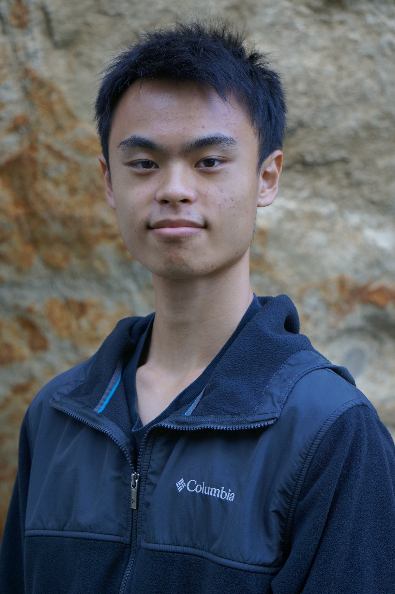
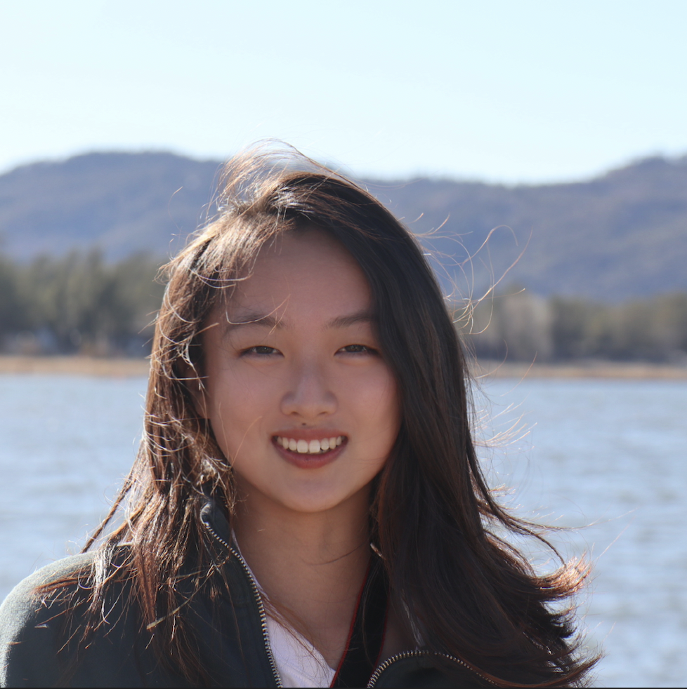
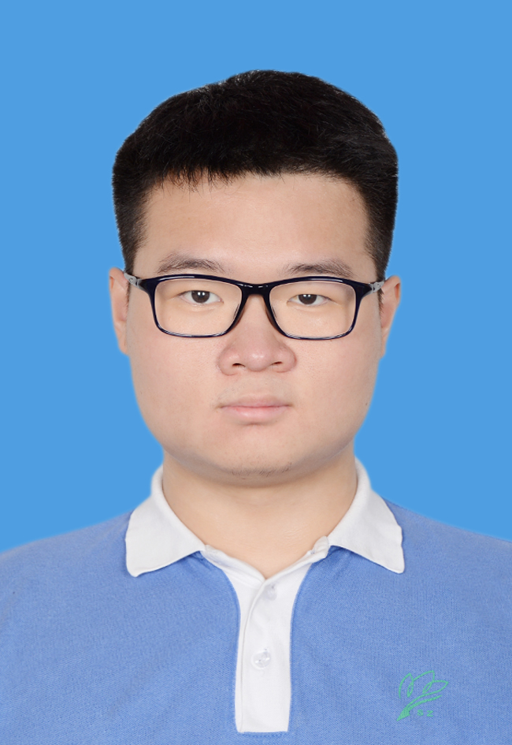
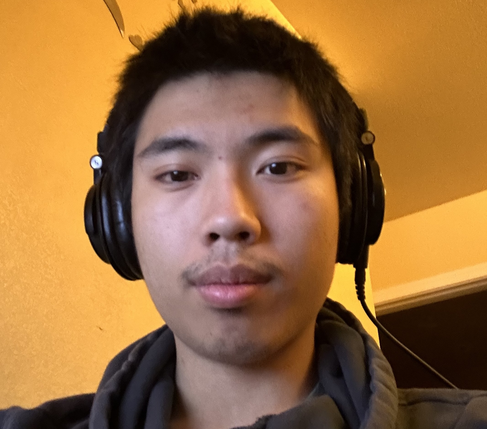
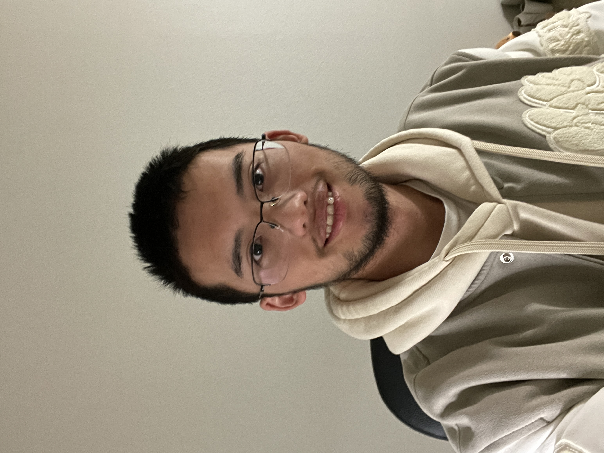
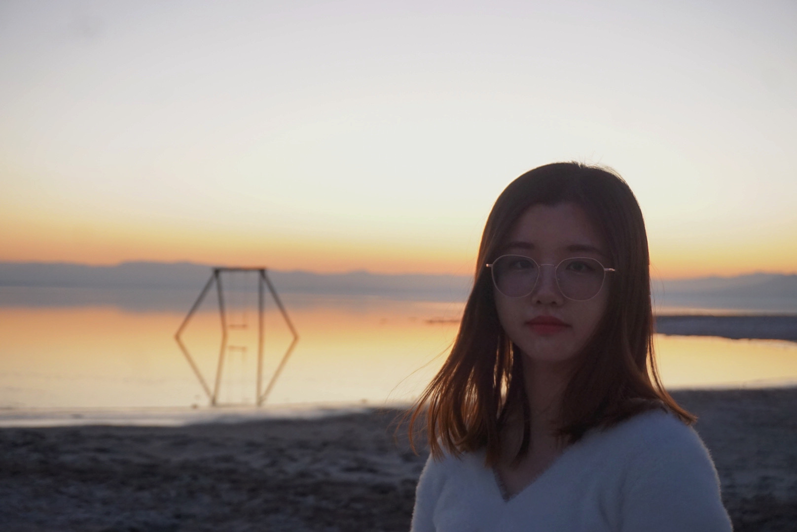
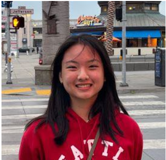
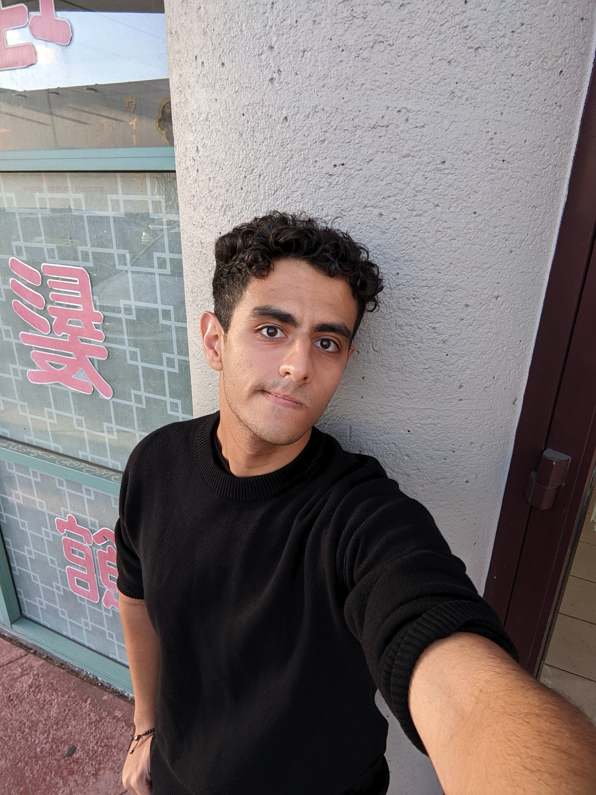
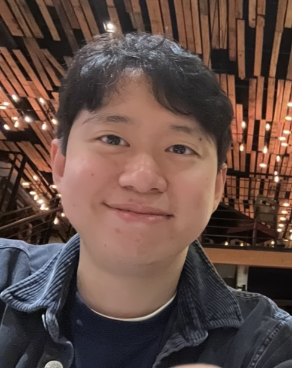

# Byte Brokers
  

<h2>We are the Byte Brokers!</h2>   
> Team 22, CSE110 SP23, UCSD

 ## Team Values 

We are a team focused on communication, trust and working together to create and complete cohesive projects. Through our work, we hope to not only better ourselves, but our teammates as well. We are committed to putting our all into our work. 

Our team desires to facilitate: 
- Psychological saftey amongst fellow members and peers.
- Efficient work completion - balanced distribution of tasks
- Accountability for work done
- Amicable relations amongst team members

As a team, members should be comfortable:
- Communicating with leaders, teammates and the group as a whole - better communication makes a better team. 
- Being active in discussion, sharing and taking ideas from others.
- Voicing concerns or criticism where they seem fit

We are focused not only on the end goal, but making the process to get there as smooth and thorough as possible. 

<h1>Meet Our Team!</h1> 

## ***Leaders***

### *Arjun Kumar*, Sophomore, Computer Engineering

**Hi! I'm Arjun**, a second year Computer Engineering major and Poli Sci minor from Warren College. I have experience working on 5G NR systems and am interested in Communication Theory and Signal Processing. Outside of the classroom, I enjoy playing sports with my friends and family, fashion and designing tattoos.

Here's the link to my [Personal Page!](https://ank010.github.io/GitHubPages110/)

### *Ryan Lee*, Sophomore, Computer Engineering

**Hi, I'm Ryan!** I am a second-year Computer Engineering at UCSD. I have tutored students in Computer Science, particularly in computer systems and architecture. In my free time I like to cook and play indie games when I should really be doing LeetCode.

Here's the link to my [Personal Page!](https://ryan-s-lee.github.io/git-refamiliarization/)

## ***Developers***

### *Jiaxin He*, Sophomore, Math-CS

                                                                                         
**My name is Jiaxin**, also go with Jessica. I am a second-year Math-Cs student, also minoring in data science. Have 3-year experience in coding and have made two projects. My comfortable coding languages are Python and C++. During my free time, usually go climbing and badminton.

Here's the link to my [Personal Page!](https://hjxhh030315.github.io/CSE110/)

### *Jiapei Chen*, Junior, Math-CS

Hello, everyone. **I am Jiapei Chen**. I am a 3rd year Math & CS student. I am comfortable with Python, Java, C++, C#. I also did some pixel art as my hobby. I hope every thing will go on well.

Here's the link to my [Personal Page!](https://chen-jiapei.github.io/Jiapei-Chen-CSE-110-Lab-1/)

### *Eric Chen*, Sophomore, Computer Science

**Hi I'm Eric Chen**, my hobbies include video games, digital art, and game development. While I'm not exactly shy in terms of speaking, don't try ask me about any of my work as I'm shy about sharing the work I care about [I have high standards and I pretty much never meet them] (;-;). If anybody wants to talk about/play video games try to ask me about it, I play quite a lot more genres than most people.

Here's the link to my [Personal Page!](https://hundred-foot-long-sweet-potato.github.io/Eric.github.io/)

### *Jinshi He*, Sophomore, Computer Engineering

**My name is Jinshi He**, a second-year CE major at Marshall. I love programing, playing games, and watching livestream. Sometimes I even livestream on myself.

Here's the link to my [Personal Page!](https://soukangc-school.github.io/CSE-110-Spring-2023-Jinshi-He-/)

### *Xin Shu*, Sophomore, Math-CS

**Hi, my name is Xin Shu**. I am a second-year student, majoring in math-cs in UCSD. I am a cat lover and enjoy spending time with them. I love outdoor exercise like skiing, surfing, diving, hiking and traveling.

Here's the link to my [Personal Page!](https://vickyshu.github.io/lab1/)

### *Jennifer Tanurdjaja*, Sophomore, Computer Science

**Hi, I'm Jennifer** and second year computer science from Marshall College. Throughout my computer science experience, I am currently interested in learning about hyperdimensional computing and its role in machine learning. Outside of the classroom, I also like to spend time at the beach, play tennis, read books, and travel places.

Here's the link to my [Personal Page!](https://jtanurdjaja.github.io/CSE-110-Lab1/)

## ***Designer***

### *Nikan Ostovan*, Senior, Cell Bio

**Hi! I'm Nikan**, my most passionate hobbies are powerlifting and random art projects that I pick up whenever I'm bored :)

Here's the link to my [Personal Page!](https://github.com/niknak1379/CSE-110-Pages-Project)

## ***Planner***

### *Chris Kim*, Junior, Computer Science

**Hi I'm Chris**.
I like food.
I like naps.

Here's the link to my [Personal Page!](https://shkimsito.github.io/website/)
